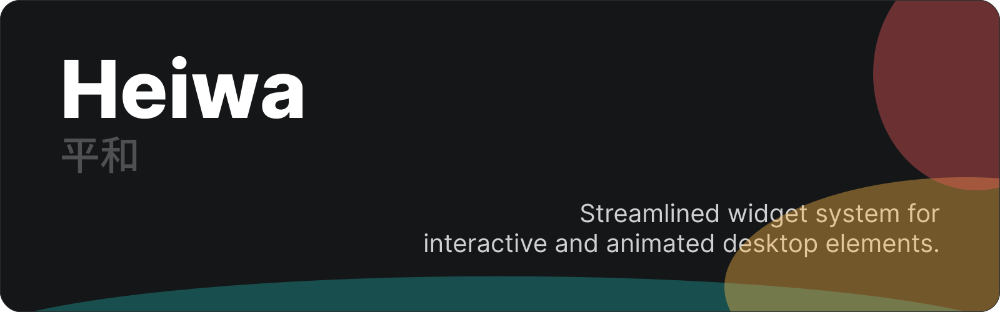

<h1>
  
</h1>

**Heiwa** is a versatile and developer-friendly widget system for Linux desktops. It enables you to create interactive widgets without any hindrance.

> [!WARNING]
> Heiwa is currently in an *alpha* version. Expect bugs and breaking changes when using it.

## Getting Started

To install Heiwa, make sure that you have an installation of [Ruby](https://www.ruby-lang.org/en/) and its package manager, `gem`.

After that, you can simply install it on your machine:

```sh
gem install heiwa 
```

### What Are Widgets?

In Heiwa, **widgets** refer to "a window that contain renderable components".

> [!NOTE]
> A (renderable) component is something that can be rendered on the screen. Components may be as simple as a rectangle, or be as complex as form inputs.

These widgets may contain two things:

- *top-level components*, which are ordinary components added to the widget tree.
- a *root component*, which is a simple component wrapper to avoid having to explicitly add each component to the widget tree. There can only be **one** root component in a widget.

### Your First Widget

As an example to show off Heiwa's capabilities, let's create a simple bar panel that will render the available *workspaces* and the *time*.

#### Configuring Heiwa

This step is quite quick. Make sure that the file `~/.config/heiwa/config.rb` exists, and if it doesn't, create it.

Here is what it should look like:

```rb
# config.rb

Config.make_config do |conf|
  conf.widgets = [:bar]
end
```

This will tell Heiwa to load the file at `~/.config/heiwa/bar/init.rb`.

#### Writing Your Widget

In Heiwa, you create widgets in Ruby. Heiwa offers an expressive and powerful DSL for creating your widgets.

Let's start by defining our widget:

```rb
# bar/init.rb

make_widget(
  title: 'Bar Panel',
  x: 0, y: 0,
  width: :max,
  height: 80,
  type: :dock
)
```

The `make_widget` function will let Heiwa know the type of widget we are creating. Let's see what this does:

- `title` will set the window title.
- `x` and `y` will set the window's position.
- `width` and `height` will set the window's height.  
  The `:max` symbol will automatically resolve the maximum allowed size. For top-level components and the widget itself, it's `Screen.width` or `Screen.height`.
- The `:dock` `type` will tell Heiwa to make the window's position *fixed*.

Now, let's create the panel itself:

```rb
panel = make(
  :rect,
  x: 0, y: 0,
  width: :max, height: :max,
  color: Color.new(30, 30, 30, 255)
)

# Add the panel to the widget root
panel.add_to_root
```

The code above will create a simple rectangle, that is the size of our widget, and has a dark color.

> [!NOTE]
> We use `add_to_root` instead of wrapping our elements in a `root` method, since we only have a single top-level component: the `panel`.
